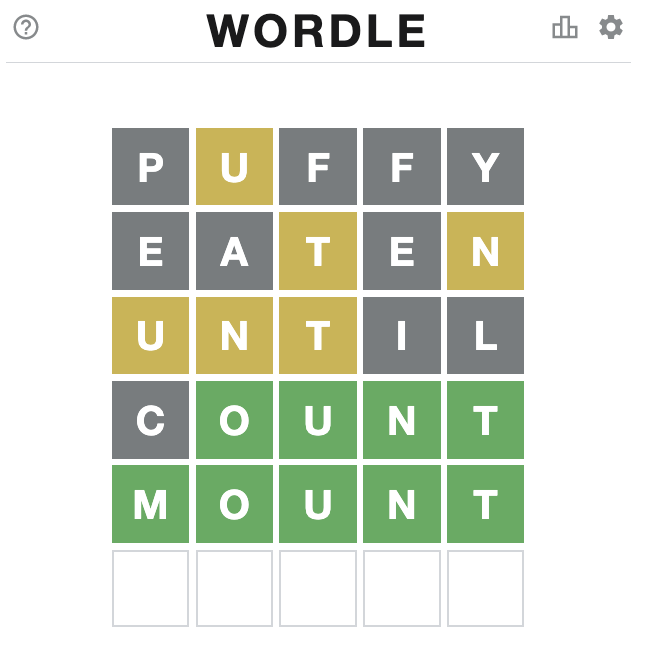

# Wordle-Helper
A python project to help you solve the Wordle game.

## 使用方法
- 線上直接使用: [Google Colab](https://colab.research.google.com/drive/1DDgXeWPE4TtI-UYyoB-50juWZFrMUek9?usp=sharing)
- 開啟 wordle.ipynb 後，上方「執行階段」選擇「全部執行」就可以開始
- 若不想要破壞猜字遊戲的體驗，建議可以等到第 3 ~ 4 猜再開始使用此工具

## 使用流程

### Step 1: 單字靈感

- 可以輸入數字來取得隨機幾個單字，當作第一個單字的靈感
- 可以使用母音多、字母不重複的單字，例如 arose
- 若想要跳過此步驟，不輸入直接按下 Enter 即可

### Step 2: 輸入猜測單字 (大小寫皆可)

### Step 3: 輸入猜測的結果

#### 輸入規則
- 綠色：o
- 灰色：x
- 黃色：?

#### 範例 1
- 輸入猜測單字: `puffy`
- 輸入此猜測的結果: `x?xxx`

#### 範例 2
- 輸入猜測單字: `until`
- 輸入此猜測的結果: `???xx`

#### 範例 3
- 輸入猜測單字: `count`
- 輸入此猜測的結果: `xoooo`

### Step 4: 從候選字挑選單字，再次猜測
### Step 5: 重複 Step 2 ~ Step 4
