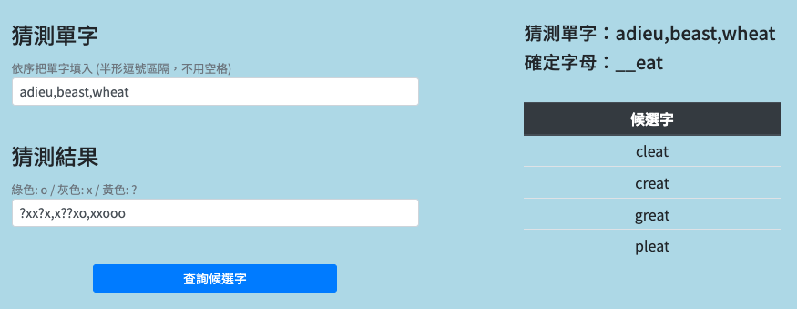

# Wordle-Helper
A python web app to help you solve the Wordle game.

## 使用工具＆框架
- Python + Django
- HTML + CSS + JS
- PythonAnywhere （免費 Web app）
- NLTK (自然語言處理包)

## 使用方法

- 網頁版直接使用: https://jumpingchu.pythonanywhere.com/wordle-helper
- 若不想要破壞猜字遊戲的體驗，建議可以等到第 3 ~ 4 猜再開始使用此工具

    

## 使用流程

### Step 1: 輸入猜測單字 (大小寫皆可)

- 建議按照猜字順序輸入
- 可利用半形逗號分隔多個單字，會過濾各種可能性

### Step 2: 輸入猜測的結果

#### 輸入規則

- 綠色：o
- 灰色：x
- 黃色：?

#### 範例 1
- 輸入猜測單字: `puffy`
- 輸入此猜測的結果: `x?xxx`

#### 範例 2
- 輸入猜測單字: `until`
- 輸入此猜測的結果: `???xx`

#### 範例 3
- 輸入猜測單字: `count`
- 輸入此猜測的結果: `xoooo`

